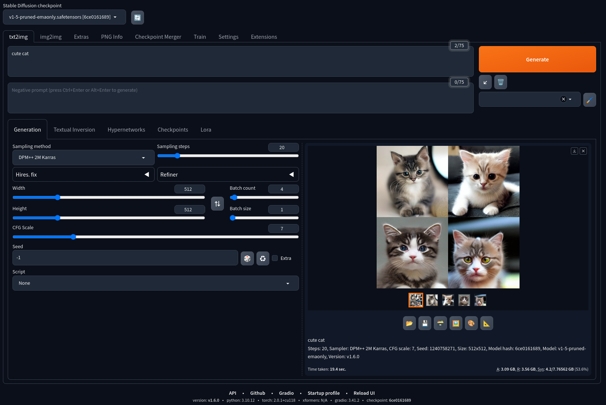

## Stable Diffusion Web UI



### Overview
Stable Diffusion은 이미지 및 텍스트 생성 작업에 사용되는 알고리즘으로 최근 매우 인기있는 기술입니다.

이 프로젝트는 Stable Diffusion Web UI 로 잘 알려진 프로젝트를 쉽게 사용할 수 있도록 제작한 패키지입니다. (AMD와 NVIDIA GPU 모두 호환)

Stable Diffusion Web UI는 Gradio 라이브러리를 기반으로 한 웹 인터페이스로 다양한 이미지 및 텍스트 생성 기능을 제공하며, Python과 Git을 설치한 후에는 원클릭으로 설치 및 실행이 가능합니다. 

주요 기능으로는 Outpainting, Inpainting, Color Sketch, Prompt Matrix, Stable Diffusion Upscale 등이 있습니다. 

추가 정보 는 GitHub 링크를 참고하세요 : [Stable Diffusion Web UI GitHub](https://github.com/AUTOMATIC1111/stable-diffusion-webui)

라이선스: AGPL-3.0


#### 기능
* 사용하기 쉬운 Stable Diffusion 웹 UI
* AMD와 NVIDIA GPU 지원
* Python 3.10 가상 환경 설정

#### 설치 방법
AMD와 NVIDIA 시스템 모두에 대한 데비안 패키지를 제공합니다. .deb 파일을 다운로드 받아 다음과 같이 설치할 수 있습니다.

```
sudo apt-get install -f ./stable-diffusion-webui-amd.deb  # AMD용
# 또는
sudo apt-get install -f ./stable-diffusion-webui-nvidia.deb  # NVIDIA용
```

설치 후에는 데스크톱 단축 아이콘을 사용하거나 다음 명령어를 실행하여 Web UI를 시작할 수 있습니다

### Overview

Stable Diffusion Web UI is a user-friendly interface for the Stable Diffusion project, designed to make it easier to manage and visualize your diffusion processes. This project is compatible with both AMD and NVIDIA GPUs.

### Features
Easy-to-use Web UI
Support for AMD and NVIDIA GPUs
Real-time monitoring and visualization
Virtual environment setup for Python 3.10

### Prerequisites
Git
Python 3.10
AMD or NVIDIA GPU
AMD: amdgpu-pro, rocm-dkms
NVIDIA: nvidia-driver, nvidia-settings, nvidia-utils

### Installation

We provide Debian packages for both AMD and NVIDIA systems. You can download the .deb file and install it using:

```
sudo dpkg -i stable-diffusion-webui-amd.deb  # For AMD
# OR
sudo dpkg -i stable-diffusion-webui-nvidia.deb  # For NVIDIA
```

### Manual Installation
```
Clone the repository:

git clone https://github.com/AUTOMATIC1111/stable-diffusion-webui.git

cd stable-diffusion-webui

./webui.sh
```

### Usage
After installation, you can start the Web UI using the desktop shortcut or by running the following command:
`stable-diffusion-webui`

### Contributing
Contributions are welcome! Please read our Contributing Guide for more information.

## License
This project is licensed under the AGPL-3.0 License - see the LICENSE file for details.

## Contact
For more information, please visit our GitHub repository or contact the maintainer.
